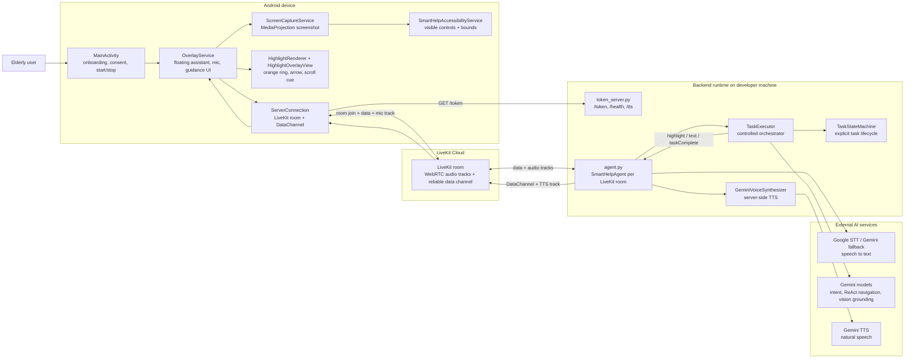
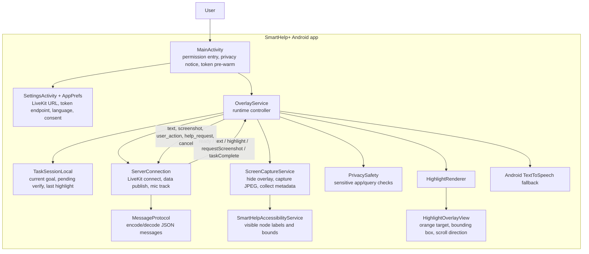
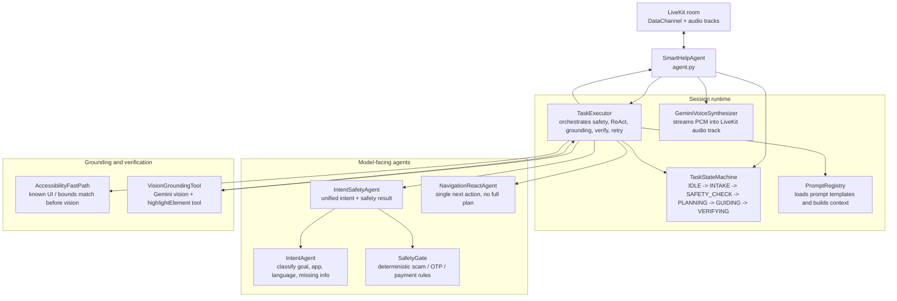
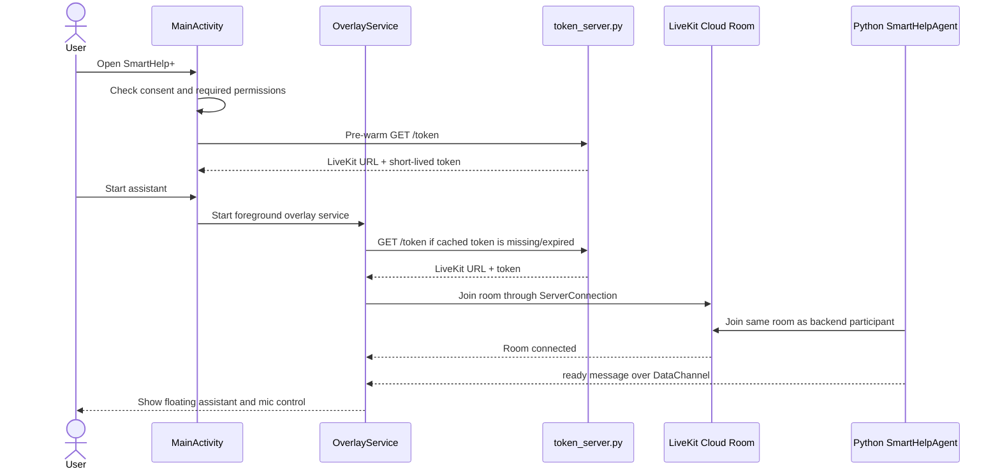
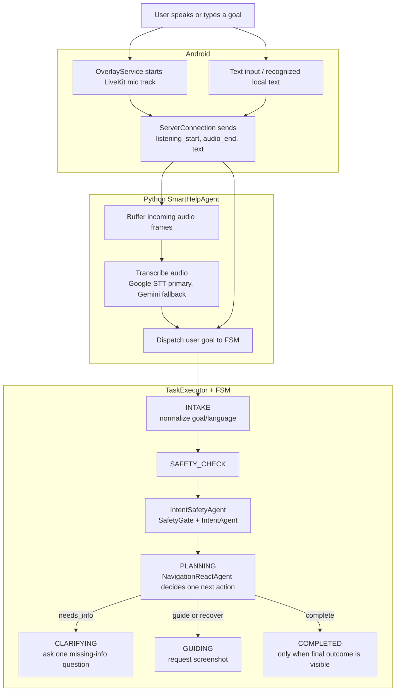
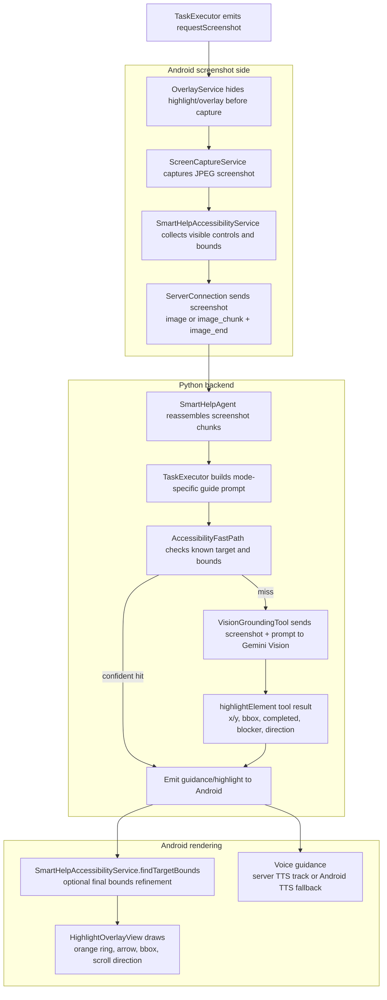
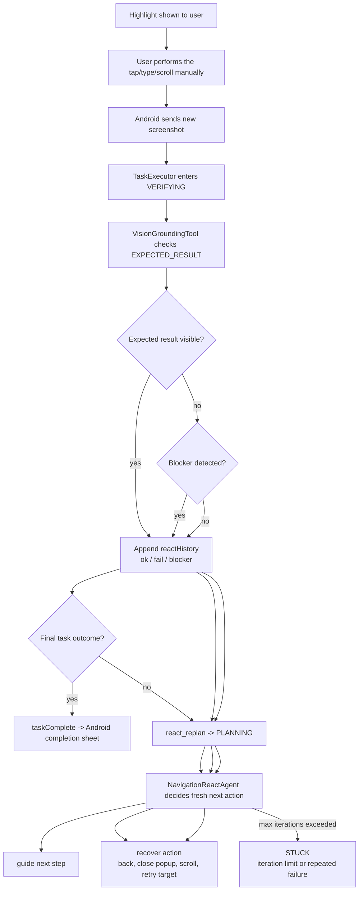
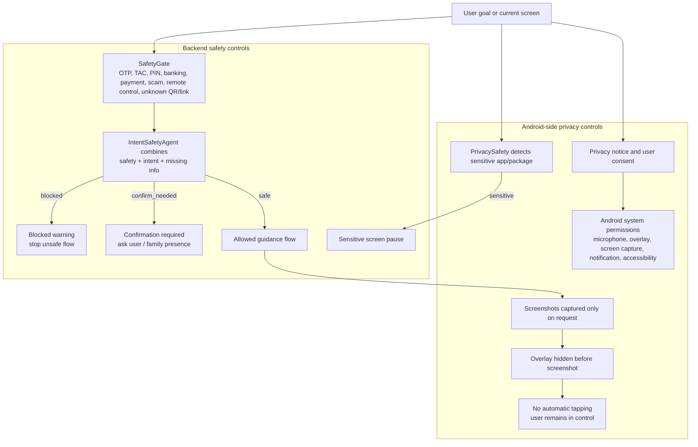
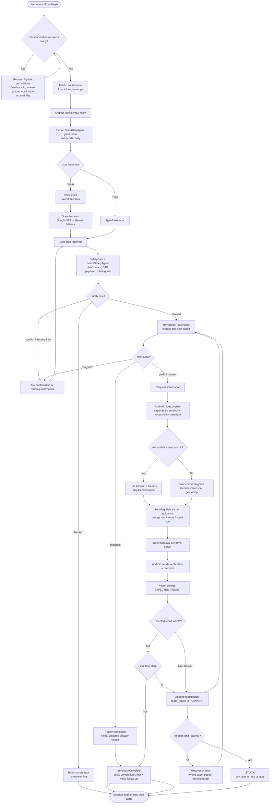

# SmartHelp+ Multi-Agent Runtime Architecture Diagrams

This file contains split architecture/runtime diagrams for the current SmartHelp+ implementation.
It reflects the Python + LiveKit + multi-agent ReAct version, not the older Node/WebSocket prototype.

## Figure 1. Overall System Deployment

## Figure 2. Android Runtime Architecture

## Figure 3. Python Multi-Agent Backend Architecture

## Figure 4. Startup And LiveKit Connection Runtime

## Figure 5. Voice Or Text Goal Intake Runtime

## Figure 6. Screenshot Grounding And Guidance Runtime

## Figure 7. Verification, Re-Planning And Completion Runtime

## Figure 8. Safety And Privacy Runtime

## Figure 9. Main System Flowchart

## Figure Numbering Suggestion For The Report

| Report figure | Suggested title |
| --- | --- |
| Figure 3.1 | Overall System Deployment Architecture |
| Figure 3.2 | Android Runtime Architecture |
| Figure 3.3 | Python Multi-Agent Backend Architecture |
| Figure 3.4 | Startup and LiveKit Connection Runtime Flow |
| Figure 3.5 | Voice/Text Goal Intake Runtime Flow |
| Figure 3.6 | Screenshot Grounding and Guidance Runtime Flow |
| Figure 3.7 | Verification, Re-Planning and Completion Runtime Flow |
| Figure 3.8 | Safety and Privacy Runtime Flow |
| Figure 3.9 | Main System Flowchart |
