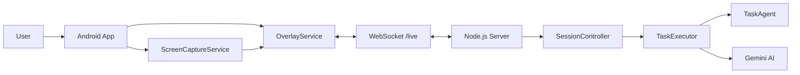

# SmartHelp Project Overview

日期：2026-04-28

## 1. Project Summary

SmartHelp 是一个 Android 智能辅助 app，帮助不熟悉手机操作的用户完成日常任务。用户可以用语音或 easy task 说出目标，系统会根据当前手机屏幕提供一步一步的文字、语音和高亮指导。

核心概念：

```text
用户目标 -> 截取当前屏幕 -> AI 分析 -> 浮窗指导 -> 用户自己操作 -> 系统验证下一步
```

SmartHelp 不会自动替用户发送信息或完成操作，用户始终自己点击和确认。

## 2. Problem Statement

很多用户知道自己想做什么，但不知道手机界面上应该怎么操作。例如：

- 不知道 WhatsApp 图标在哪里。
- 不知道联系人搜索框在哪里。
- 不知道下一步应该点什么。
- 害怕点错。
- 需要别人重复教同样的手机操作。

SmartHelp 的目标是把这些复杂操作拆成简单步骤，并在屏幕上直接指导用户。

## 3. Target Users

主要用户：

- 老年用户。
- 不熟悉智能手机的人。
- 对 app 操作没有信心的人。
- 需要语音和视觉提示的人。
- 需要一步一步完成手机任务的人。

典型使用场景：

- 发送 WhatsApp。
- 打电话。
- 打开相机。
- 打开设置。
- 跟随当前屏幕完成下一步操作。

## 4. Main Features

| Feature | Description |
| --- | --- |
| Easy Tasks | 用户可以直接点击常见任务，例如 WhatsApp、Call、Camera |
| Voice Input | 用户可以说出想完成的任务 |
| Floating Overlay | App 在其他应用上方显示指导 |
| Screen Capture | 截取当前屏幕，让 AI 判断当前界面 |
| AI Guidance | Server 使用 Gemini 分析任务和屏幕 |
| Visual Highlight | 在目标位置显示高亮或箭头 |
| Text-to-Speech | Android 把指导文字朗读出来 |
| Clarification | 信息不完整时先问用户，不乱猜 |

## 5. System Architecture



系统分成三层：

| Layer | Responsibility |
| --- | --- |
| Android App | 用户输入、浮窗、截图、语音朗读、高亮显示 |
| Node.js Server | WebSocket 连接、任务流程控制、AI 调度 |
| Gemini AI | 理解用户目标、分析截图、生成下一步指导 |

## 6. Android Components

| Component | Purpose |
| --- | --- |
| `MainActivity` | 主界面，启动 assistant，设置 server |
| `OverlayService` | 显示浮窗、文字指导、TTS 和高亮 |
| `ScreenCaptureService` | 获取当前屏幕截图 |
| `GeminiLiveClient` | Android WebSocket client |
| `ServerConnection` | 封装与 server 的连接 |
| `AppPrefs` | 保存 server address、token、语言和 quick tasks |

## 7. Server Components

| Component | Purpose |
| --- | --- |
| `index.js` | 启动 HTTP server 和 WebSocket |
| `SessionController` | 管理 Android client session |
| `TaskExecutor` | 执行 planning、guidance、verification |
| `TaskAgent` | 把用户目标拆成步骤 |
| `GeminiLiveAgent` | 和 Gemini 连接，处理截图指导 |
| `PromptRegistry` | 管理 AI prompts |

Server 主要流程：

```text
Android sends goal/screenshot
-> Server plans task
-> Gemini analyzes screen
-> Server sends guidance
-> Android shows overlay
-> User performs action
-> Server verifies progress
```

## 8. User Flow

### First-Time Setup

1. 打开 SmartHelp。
2. 设置 server address。
3. 输入 token，如果 server 需要。
4. 授权 microphone。
5. 授权 overlay。
6. 授权 screen capture。
7. 点击 start assistant。

### Daily Use

1. 打开 SmartHelp。
2. 点击 start assistant。
3. 选择 easy task 或按 microphone 说出目标。
4. 等待浮窗显示第一步指导。
5. 根据文字、语音和高亮操作手机。
6. 系统继续给出下一步。
7. 完成后停止 assistant。

## 9. Example Demo Flow: WhatsApp Family

目标：

```text
Send a WhatsApp message to my daughter
```

流程：

1. 用户点击 WhatsApp family easy task。
2. Android 把任务发送给 server。
3. Server 发现 “my daughter” 不是具体联系人名。
4. Assistant 先问联系人名字。
5. 用户回答具体联系人名。
6. SmartHelp 继续引导用户进入 WhatsApp。
7. AI 根据当前 WhatsApp 屏幕给出下一步。
8. Android 显示文字、语音和高亮。
9. 用户自己选择联系人、输入内容并确认发送。

重点：

- 不猜联系人。
- 不自动发送消息。
- 用户自己确认每一步。

## 10. Technology Stack

| Part | Technology |
| --- | --- |
| Android | Java, Android SDK, Foreground Service, MediaProjection, TextToSpeech |
| Network | WebSocket |
| Server | Node.js, Express, ws |
| AI | Gemini Live, Gemini Planner |
| Local Storage | SharedPreferences |
| Testing | Android Gradle test, Android lint, Node.js tests |

## 11. How to Run

### Server

```powershell
cd "C:\Users\HP\Downloads\FYP 1\SmartHelp\server"
npm install
$env:GEMINI_API_KEY="your-gemini-api-key"
$env:SMARTHELP_SERVER_TOKEN="your-token"
npm start
```

Local demo without token:

```powershell
$env:SMARTHELP_REQUIRE_WS_AUTH="false"
npm start
```

### Android

```powershell
cd "C:\Users\HP\Downloads\FYP 1\SmartHelp\android"
.\gradlew.bat assembleDebug
.\gradlew.bat installDebug
```

## 12. Demo Script

推荐演示：

1. 启动 server。
2. 打开 Android app。
3. 设置 server address。
4. 启动 assistant。
5. 点击 WhatsApp family。
6. 展示 assistant 先问联系人名字。
7. 回答联系人名字。
8. 展示 WhatsApp guidance 和 highlight。
9. 展示语音和字幕一致。
10. 停止 assistant。

